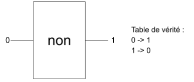

# Cours calcule IP

## 1 - Calcul du masque en décimal à l’aide du tableau binaire
Comme le CIDR est de 12, ça veut dire qu’il y a 12 “1” en partant de la gauche vers la droite,
donc ça nous donne le masque en binaire :
1111 1111.1111 0000.0000 0000.0000 0000
Ce qui est égal en décimale : 255.240.0.0

## 2 - Calcul du masque inverse (Wildcard)
Comme son nom l’indique, la wildcard est le masque inversé (les 1 deviennes des 0 et vice
versa)
Donc on prend notre masque en binaire et on applique le NON.

|  |1er octet | 2eme octet| 3eme octet | 4eme octet |
|:------|:----------:|:------:|:------:| :------:|
| Masque | 1 1 1 1 1 1 1 1 | 1 1 1 1 0 0 0 0 | 0 0 0 0 0 0 0 0 | 0 0 0 0 0 0 0 0 |
| Wildcard | 0 0 0 0 0 0 0 0 | 0 0 0 0 1 1 1 1 | 1 1 1 1 1 1 1 1 | 1 1 1 1 1 1 1 1 |

## 3 - Calcul de l’adresse réseau
Comme pour la wildcard on va utiliser une table de vérité qui s’appelle ET.
Pour le calcul, nous allons prendre le masque en binaire et l’adresse IP en binaire
pour les superposer dans un tableau afin d’appliquer la table de vérité.

|  |1er octet | 2eme octet| 3eme octet | 4eme octet |
|:------|:----------:|:------:|:------:| :------:|
| Masque | 1 1 1 1 1 1 1 1 | 1 1 1 1 0 0 0 0 | 0 0 0 0 0 0 0 0 | 0 0 0 0 0 0 0 0 |
| @IP | 1 0 0 0 1 1 1 0 | 1 1 1 1 0 1 0 0 | 0 0 0 0 1 1 0 1 | 0 0 0 1 0 1 1 1 |
| @ réseau | 1 0 0 0 1 1 1 0 | 1 1 1 1 0 0 0 0 | 0 0 0 0 0 0 0 0 | 0 0 0 0 0 0 0 0 |

1ère ligne, c'est le masque, la 2ᵉ c’est l’adresse IP et la 3ᵉ c’est l’adresse réseau qu’on a
eue en appliquant l'ET sur les 2 premières lignes.
Donc ça nous donne : 142. 240.0.0

## 4 - Calcul de la Broadcast
Le processus est similaire à celui de l’adresse réseau mais a la différence qu’on va utiliser la
table OU à la place de ET.
Donc on prend la wildcard et l’adresse réseau et on utilise la table OU :

|  |1er octet | 2eme octet| 3eme octet | 4eme octet |
|:------|:----------:|:------:|:------:| :------:|
| Wildcard | 0 0 0 0 0 0 0 0 | 0 0 0 0 1 1 1 1 | 1 1 1 1 1 1 1 1 | 1 1 1 1 1 1 1 1 |
| @ réseau | 1 0 0 0 1 1 1 0 | 1 1 1 1 0 0 0 0 | 0 0 0 0 0 0 0 0 | 0 0 0 0 0 0 0 0 |
| Broadcast | 1 0 0 0 1 1 1 0 | 1 1 1 1 1 1 1 1 | 1 1 1 1 1 1 1 1 | 1 1 1 1 1 1 1 1 0 |

Donc ça nous donne : 142.255.255.255

## 5 - Calcul de la première adresse affectable
La formule pour ce calcule est :
@réseau + 1

= 142.240.0.0 + 0.0.0.1

= 142.240.0.1

## 6 - Calcul de la dernière adresse affectable
La formule pour ce calcule est :
Broadcast - 1

= 142.255.255.255 - 0.0.0.1

= 142.255.255.254

## 7 - Nombre de sous-réseau
Pour ce calcul nous devons simplement compter les 1 de l’octet incomplet du masque, dans
notre exemple l’octet incomplet est le 2eme : 1111 0000 donc il y en a 4, on doit en fait une
puissance de 2 (2^4) et pour finir le résultat doit être soustrait par 2 .
2^4 - 2 = 16 - 2 = 14

## 8 - Nombre de hôtes par sous-réseau
Pour le nombre d’hôtes c’est encore plus simple on compte tous les 0 du masque.
Il y a 20 0 dans le masque, on doit en faire une puissance de 2 et on le soustrait par 2.
2^20-2 = 1 048 576 - 2 = 1 048 574

## 9 - Classe IP
Les classe d’IP sont les suivante :

## Auteur

